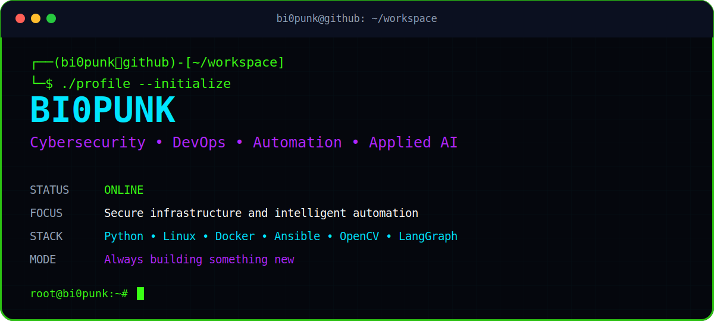

<div align="center">



<br>


</div>

---

## `root@bi0punk:~# whoami`

```yaml
identity:
  alias: bi0punk
  role:
    - Cybersecurity Engineer
    - DevOps Engineer
    - Automation Developer

location: Chile
operating_system: Linux
working_mode: CLI-first
status: Building secure systems
```

Cybersecurity and DevOps engineer focused on practical automation, secure infrastructure, observability, applied artificial intelligence and production-grade systems.

I build reproducible platforms that connect development, operations and security: from infrastructure as code and deployment pipelines to threat detection, local AI agents, computer vision and data engineering.

---

## `root@bi0punk:~# cat focus.conf`

```ini
[cybersecurity]
threat_detection = enabled
infrastructure_hardening = enabled
incident_automation = enabled
security_monitoring = enabled
vulnerability_assessment = enabled

[devops]
infrastructure_as_code = enabled
continuous_delivery = enabled
configuration_management = enabled
containerization = enabled
observability = enabled

[artificial_intelligence]
local_llm = enabled
rag_systems = enabled
computer_vision = enabled
automation_agents = enabled
data_analysis = enabled
```

---

## `root@bi0punk:~# ./stack --full`

<table>
<tr>
<td width="50%" valign="top">

### Core


### Backend


### AI and Data


</td>
<td width="50%" valign="top">

### Infrastructure


### Observability


### Security


</td>
</tr>
</table>

---

## `root@bi0punk:~# ls current-projects/`

```text
├── devops-automation/
│   ├── deployment-generators
│   ├── configuration-management
│   └── infrastructure-validation
│
├── security-platforms/
│   ├── threat-detection
│   ├── event-correlation
│   └── incident-automation
│
├── applied-ai/
│   ├── local-llm-agents
│   ├── rag-systems
│   ├── computer-vision
│   └── intelligent-monitoring
│
├── data-engineering/
│   ├── collectors
│   ├── processing-pipelines
│   ├── analytics
│   └── executive-dashboards
│
└── iot-systems/
    ├── sensors
    ├── environmental-monitoring
    ├── automation
    └── edge-computing
```

---

## `root@bi0punk:~# cat engineering-principles.md`

```text
[01] Automate repetitive operations.
[02] Secure systems from the design phase.
[03] Treat infrastructure as versioned code.
[04] Add logs, metrics and traces before incidents happen.
[05] Prefer reproducible systems over manual procedures.
[06] Build modular architectures that can evolve.
[07] Measure before optimizing.
[08] Document decisions, not only commands.
[09] Convert prototypes into production systems.
[10] Keep learning and keep shipping.
```

---

## `root@bi0punk:~# github-stats`

<div align="center">


</div>

> Change `bi0punk` in the URLs if your GitHub username is different.

---

## `root@bi0punk:~# system-status`

```diff
+ Infrastructure automation       ONLINE
+ Threat detection                ONLINE
+ Security monitoring             ONLINE
+ Local artificial intelligence   ONLINE
+ Data processing pipelines       ONLINE
+ Computer vision systems         ONLINE
+ Continuous learning             ALWAYS ON
```

---

<div align="center">

### `ACCESS GRANTED`


```text
Automate everything.
Secure everything.
Observe everything.
Keep building.
```

**“Hack the planet, automate the boring stuff and engineer systems that last.”**

</div>
